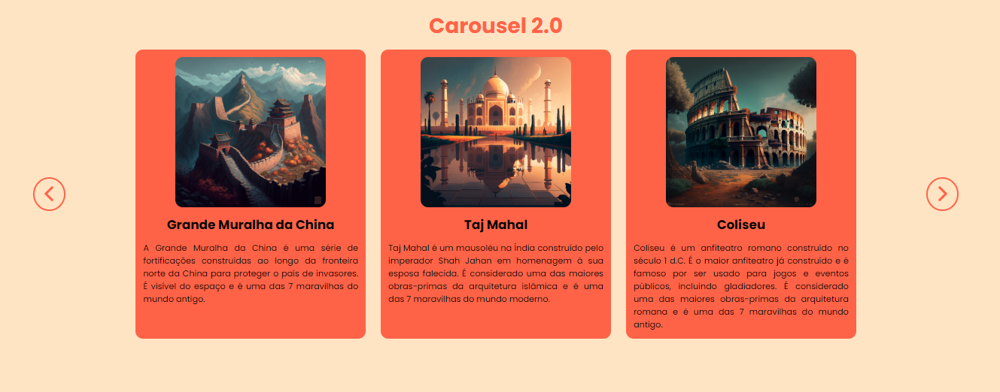

# Carousel 2.0

## Proposta do projeto

Este projeto consiste em criar três boxes de conteúdo, que serão preenchidos com dados obtidos de uma API local (arquivo JSON). Os boxes serão navegáveis através de um carousel, permitindo ao usuário alternar entre o conteúdo de cada box.

## 🚀 Acessando a interface

Para acessar o projeto, basta [clicar aqui](https://omniscient-wave.surge.sh/)

> Projeto disponivel no link acima até 16/05/2023.

## 📝 Licença

Esse projeto está sob licença. Veja o arquivo [LICENÇA](LICENSE.md) para mais detalhes.

## Status

🎯 Concluído

[⬆ Voltar ao topo](#Carousel) 