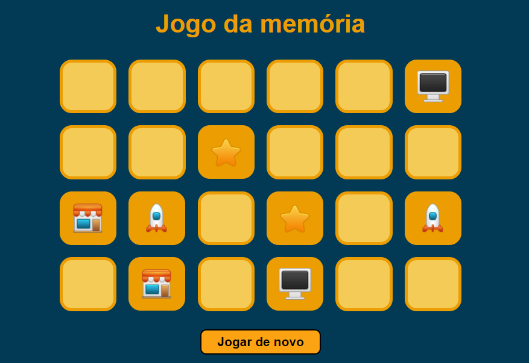

# Jogo da memória

## Proposta do projeto

Faça um jogo de memória usando grid para organizar os cartões e eventos do DOM para detectar quando um cartão é clicado e virá-lo.

> Projeto feito utilizando HTML e CSS e Javascript com o intuito de aperfeiçoar meus conhecimentos em grid layout e responsividade.

## 🚀 Acessando a interface

Para acessar o projeto, basta [clicar aqui](https://psychedelic-book.surge.sh/)

> Projeto disponivel no link acima até 15/05/2023.

## 📝 Licença

Esse projeto está sob licença. Veja o arquivo [LICENÇA](LICENSE.md) para mais detalhes.

## Status

🎯 Concluído

[⬆ Voltar ao topo](#Jogo-da-memória) 