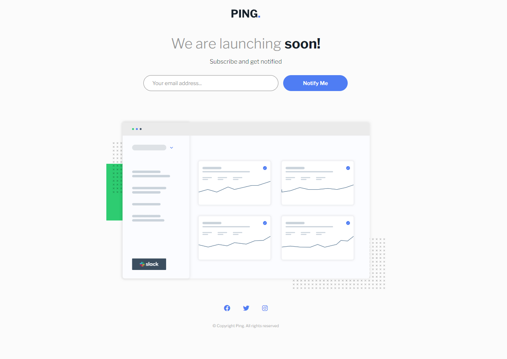

# Conhecendo Sass

> Prejeto feito com o propósito de conhecer melhor o [SASS](https://sass-lang.com/). A ideia da interface do projeto foi feita apartir de um layout presente em um dos desafios do [Frontend-Mentor](https://www.frontendmentor.io/challenges/ping-single-column-coming-soon-page-5cadd051fec04111f7b848da). No projeto utilizei HTML, SASS e Javascript. No decorrer do projeto, tentei explorar ao máximo os recursos do pré-processor em questão, muito embora, este tenha cido meu primeiro contato com o mesmo.

## 🚀 Acessanado o projeto

Para acessar o projeto, basta [clicar aqui](https://sad-taste.surge.sh/)

## 📝 Licença

Esse projeto está sob licença. Veja o arquivo [LICENÇA](LICENSE.md) para mais detalhes.

[⬆ Voltar ao topo](#conhecendo-sass) 
