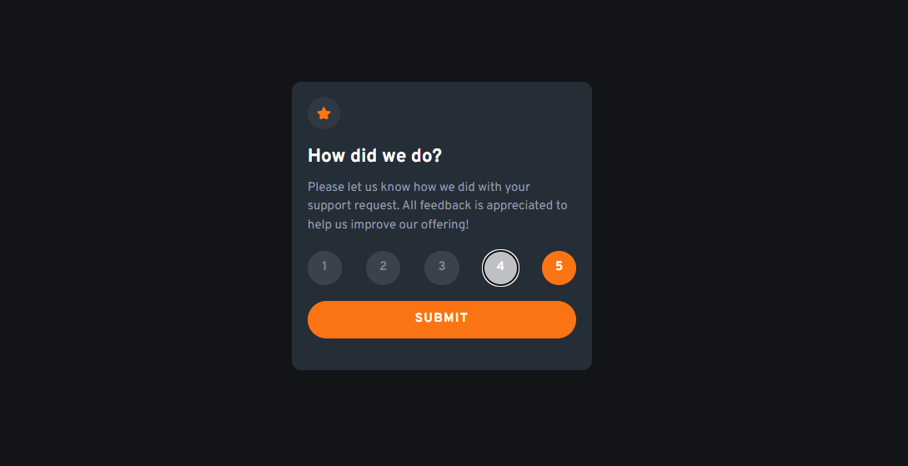

# Conhecendo TailwindCSS

> Prejeto feito com o propósito de conhecer o framework [TailwindCSS](https://tailwindcss.com/). A ideia da interface do projeto foi feita apartir de um layout presente em um dos desafios do [Frontend-Mentor](https://www.frontendmentor.io/challenges/interactive-rating-component-koxpeBUmI). No projeto utilizei HTML, CSS (TailwindCSS) e Javascript. No decorrer do projeto, tentei explorar ao máximo os recursos do framework em questão, muito embora, este tenha cido meu primeiro contato com o mesmo.

## 🚀 Acessanado o projeto

Para acessar o projeto, basta [clicar aqui](https://enchanting-voyage.surge.sh/)

## 📝 Licença

Esse projeto está sob licença. Veja o arquivo [LICENÇA](LICENSE.md) para mais detalhes.

[⬆ Voltar ao topo](#conhecendo-tailwindcss) 
