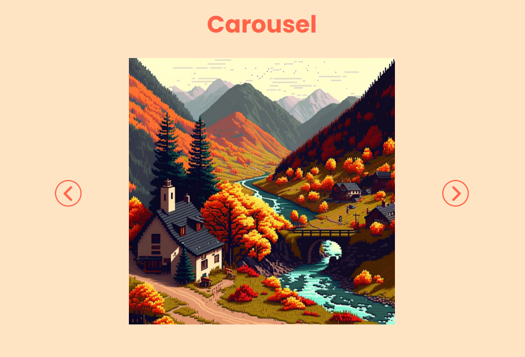

# Carousel

## Proposta do projeto

Criar um carousel de imagens usando flexbox e eventos do DOM para detectar quando a seta esquerda ou direita é clicada e mudar a imagem exibida.

## 🚀 Acessando a interface

Para acessar o projeto, basta [clicar aqui](https://spotted-question.surge.sh/)

> Projeto disponivel no link acima até 16/05/2023.

## 📝 Licença

Esse projeto está sob licença. Veja o arquivo [LICENÇA](LICENSE.md) para mais detalhes.

## Status

🎯 Concluído

[⬆ Voltar ao topo](#Carousel) 