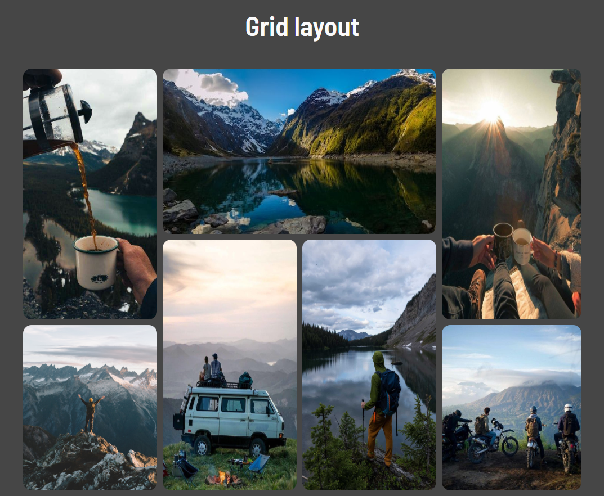

# Grid Layout

## Proposta do projeto

Criar uma página com uma grade de imagens usando o grid, e adicionar um efeito hover para que as imagens aumentem de tamanho quando passadas com o mouse.

> Projeto feito utilizando HTML e CSS com o intuito de aperfeiçoar meus conhecimentos em grid layout e responsividade.

## 🚀 Acessando a interface

Para acessar o projeto, basta [clicar aqui](https://gridlayout.surge.sh/)

> Projeto disponivel no link acima até 15/05/2023.

## 📝 Licença

Esse projeto está sob licença. Veja o arquivo [LICENÇA](LICENSE.md) para mais detalhes.

## Status

🎯 Concluído

[⬆ Voltar ao topo](#Grid-Layout) 