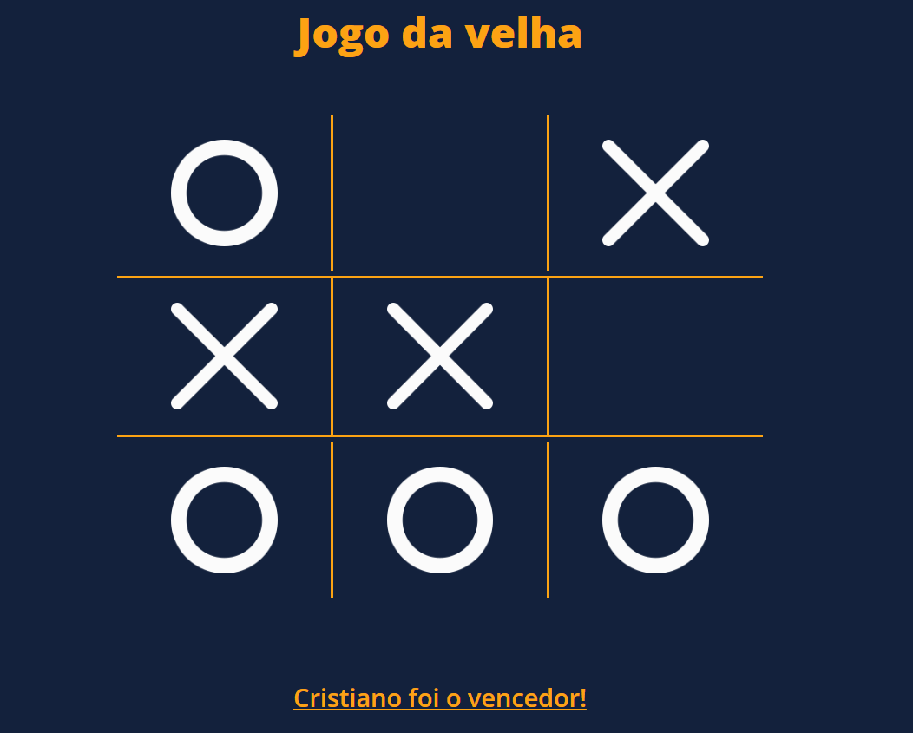

# Jogo da velha

## Proposta do projeto

Fazer um jogo da velha usando flexbox para organizar os elementos na tela. Utilizando eventos do DOM para detectar quando um quadrado é clicado e alterar a cor para indicar jogada.

> Projeto feito utilizando HTML, CSS e JS com o intuito de aperfeiçoar meus conhecimentos em flex-box e interações com o DOM.

## 🚀 Acessando a interface

Para acessar o projeto, basta [clicar aqui](https://spiteful-steam.surge.sh/)

> Projeto disponivel no link acima até 16/05/2023.

## 📝 Licença

Esse projeto está sob licença. Veja o arquivo [LICENÇA](LICENSE.md) para mais detalhes.

## Status

🎯 Concluído

[⬆ Voltar ao topo](#Grid-Layout) 