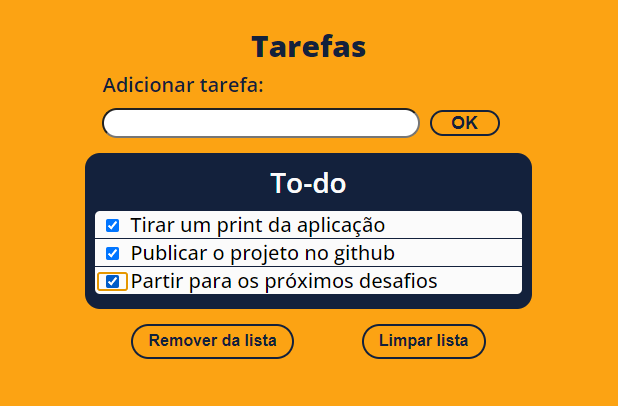

# Tarefas

## Proposta do projeto

Criar uma lista de tarefas utilizando eventos do DOM para adicionar novas tarefas à lista e remover tarefas existentes.

> Projeto feito utilizando HTML, CSS e JS com o intuito de aperfeiçoar meus conhecimentos em CSS e interações com o DOM.

## 🚀 Acessando a interface

Para acessar o projeto, basta [clicar aqui](https://fantastic-question.surge.sh/)

> Projeto disponivel no link acima até 16/05/2023.

## 📝 Licença

Esse projeto está sob licença. Veja o arquivo [LICENÇA](LICENSE.md) para mais detalhes.

## Status

🎯 Concluído

[⬆ Voltar ao topo](#Tarefas) 